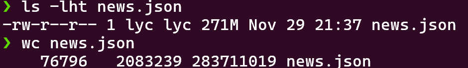

## 实验样例

我所选取的数据是这样子很多条新闻，每条新闻均为一行 json 类的数据，包含 content, title等内容。

分词和数据检索仅针对其中的 content 进行操作。

可以看到总共有 76796 行

## 实验思路

### 数据处理

我们的数据是 json 类型的，我们需要把其中的 content 提提取出来。 

解决思路 : 使用 c++ 的 boost 库中的 ptree 和 json_parser 进行处理妇女此

~~~ c++
#include <boost/property_tree/json_parser.hpp>
#include <boost/property_tree/ptree.hpp>
~~~

### 为新闻赋予索引值

每个新闻我们按照行号赋予 $0,1,2,3,...$ 的索引。

当我们想要访问一篇新闻时，我们可以行号从上往下遍历通过 '\\n' 来找到相应新闻，但对应的速度是很慢的。 

为了更快的利用索引访问对应新闻内容，我们可以对新闻索引建一个目录。

即求出每一行相对于新闻开头的位置。

为了更好的空间和时间效率，我们放弃存可读的 acill 文本，转而直接用二进制存储。

#### 建立新闻目录
~~~ c++
void index_builder::news_offset_to_file(const std::string& news_path) const {
    std::ofstream offset_file(NEWS_OFFSET_PATH, std::ios::binary);
    std::ifstream news_file(news_path);
    if (!news_file.is_open()) {
        std::cerr << "unable to open the file" << news_path << '\n';
        return;
    }
    std::string line;
    while (news_file.good()) {
        write_integer<u32>(offset_file, news_file.tellg());
        std::getline(news_file, line);
    }

    news_file.close();
    offset_file.close();
}
~~~

#### 快速的新闻文章

查找复杂度 $O(1)$

~~~ c++
ptree get_news(u32 idx) {
    std::ifstream offset_file(NEWS_OFFSET_PATH, std::ios::binary);
    offset_file.seekg(4 * idx, std::ios::beg);
    u32 offset;
    offset_file.read(reinterpret_cast<char*>(&offset), sizeof(offset));
    std::ifstream news_file(news_path);
    if (!news_file.is_open()) {
        std::cerr << "unable to open file " << news_path << '\n';
        exit(0);
    }
    news_file.seekg(offset);
    std::string line;
    std::getline(news_file, line);
    ptree pt;
    std::stringstream ss;
    ss << line;
    read_json(ss, pt);
    return pt;
}

void print_news(const ptree& data) {
    std::cout << "Title : " << data.get<std::string>("title") << '\n';
    std::cout << "time : " << data.get<std::string>("time") << '\n';
    std::cout << "desc : " << data.get<std::string>("desc") << '\n';
    std::cout << data.get<std::string>("content") << '\n';
}

int main(int argc, char* argv[]) {
    if (argc == 1) {
        std::cout << "please input the idx of the news like\n ./get_news [idx]\n";
        return 1;
    }
    std::ifstream news_path_file(NEWS_PATH_FILE_PATH);
    news_path_file >> news_path;
    std::stringstream ss;
    int idx;
    ss << argv[1];
    ss >> idx;
    ptree data = get_news(idx);
    print_news(data);
}
~~~

### 分词/关键词提取

利用 cppjieba 进行分词 / 关键词提取

~~~ c++

const string ROOT_PATH = "../cppjieba/";
const string DICT_PATH = ROOT_PATH + "dict/jieba.dict.utf8";
const string HMM_MODEL_PATH = ROOT_PATH + "dict/hmm_model.utf8";
const string IDF_PATH = ROOT_PATH + "dict/idf.utf8";
const string STOP_WORD_PATH = ROOT_PATH + "dict/stop_words.utf8";

index_builder::index_builder() : seg(DICT_PATH, HMM_MODEL_PATH), extractor(DICT_PATH, HMM_MODEL_PATH, IDF_PATH, STOP_WORD_PATH) {}

~~~

### 建立索引

我们对每篇文章分完词后，可以直接使用 c++ 自带的 unodered_map 记录每个单词出线在了哪些文章上中

~~~ c++
using dict = std::unordered_map<std::string, std::vector<index_t>>;

dict dic;

void index_builder::add(const std::string& word, index_t idx) {
    if (dic.find(word) == dic.end()) {
        dic[word] = {idx};
    } else {
        // some word may appear twice in passage
        if (dic[word].back() != idx) dic[word].push_back(idx);
    }
}

void index_builder::add_news(const std::string& news_line, index_t idx) {
    std::vector<std::string> words;
    ptree pt;
    std::stringstream ss;
    ss << news_line;
    read_json(ss, pt);
    string doc{pt.get<std::string>("content")};
    extractor.Extract(news_line, words, 40);
    for (const std::string& word : words) {
        add(word, idx);
    }
}
~~~

### 保存索引

我的实验目的是 build once,search many times. 所以我们将建好的索引保存至本地，以方便后续利用本地文件进行查找。

我们可以在在新建两个文章 **offset** 和 **index**

在 index 中我们记录每个单词的内容信息，即每个单词出现在了哪些文章当中

但是我们只关心当前我们需要查找的单词，无需把 index 直接读出来。

所以我们可以在 offset 建立一个目录，记录每个单词对应内容在 index 中的偏移量

但其实目录的大小依然很大，这依然是一个时间上的瓶颈

我们优化，我们首先利用 hash 让目录变得规整。

因为如果我们在目录中存储单词的话，单词长度的长短不一会让我们处理变得很棘手，为了规整目录，我们可以计算单词的 hash 值，用 hash 值来存储

这样目录文件的结构类似于一个数组。问题就变成了在数组里面查找元素。

而在数组里面查找数据很简单的思路就是先将数组排序，再二分查找。

~~~ c++
const u64 BASE = 1331;

u64 get_hash(const std::string& str) {
    u64 ans = 0;
    for (const char ch : str) ans = ans * BASE + ch;
    return ans;
}
~~~

使用 hash 就必须不能忽视 hash 可能冲突这件事。建立索引时，单词数量的大小为 $2\times 10^6$ 数量级。计算可以知道发生概率的可能性是十分渺茫的。而且我们在建立索引的时候可以知道有没有碰撞的发生，如果真发生了碰撞，可以直接报错并修改hash方法。

查找的时候为了避免 hash 冲突我们可以在 index 每条数据前面写上数据对应的单词。

~~~ c++
void index_builder::index_to_file() const {
    std::vector<std::pair<u64, std::string>> f;
    for (const auto& item : dic) {
        f.emplace_back(get_hash(item.first), item.first);
    }

    sort(f.begin(), f.end());
    std::cout << "the number of word is " << f.size() << ".\n";
    // ensure no hash collision
    for (int i = 1; i < f.size(); ++i) {
        if (f[i].first == f[i - 1].first) {
            std::cout << "hash collision: " << f[i].second << " " << f[i - 1].second << "\n";
        }
    }

    std::ofstream offset_file(OFFSET_FILE_NAME, std::ios::binary);
    std::ofstream index_file(INDEX_FILE_NAME, std::ios::binary);

    for (const auto& [hash_val, word] : f) {
        // std::cout << word << '\n';
        const auto& list = dic.at(word);
        write_integer<u64>(offset_file, hash_val);
        write_integer<u64>(offset_file, index_file.tellp());

        write_integer<u32>(index_file, word.size());
        index_file.write(word.c_str(), word.size());

        write_integer<index_t>(index_file, list.size());

        for (const index_t idx : list) {
            write_integer<index_t>(index_file, idx);
        }
    }
    offset_file.close();
    index_file.close();
}

~~~

### 单词查找

单词查找的思路在上一部分已经大致讲清，大致就是在索引目录文件中进行二分查找。

~~~ c++
const u64 NOT_FOUND = 0xffffffffffffffff;
// file 是由无数 [val(u64),offset(u64)] 这样结构单元构成
u64 search_file(const std::string& filename, u64 val) {
    std::ifstream file(filename, std::ios::binary);
    auto get_val = [&file](int i) {
        u64 val;
        file.seekg(16 * i, std::ios::beg);
        file.read(reinterpret_cast<char*>(&val), sizeof(val));
        return val;
    };
    int sz = fs::file_size(filename) / 16;
    int l = 0, r = sz - 1;

    while (l < r) {
        int mid = (l + r) >> 1;
        u64 t = get_val(mid);
        if (t >= val) {
            r = mid;
        } else {
            l = mid + 1;
        }
    }

    if (get_val(r) != val) return NOT_FOUND;
    u64 ans;
    file.seekg(16 * r + 8, std::ios::beg);
    file.read(reinterpret_cast<char*>(&ans), sizeof(ans));
    return ans;
}

std::vector<index_t> query_word(const std::string& word) {
    u64 h = get_hash(word);
    u64 offset = search_file(OFFSET_FILE_NAME, h);
    if (offset == NOT_FOUND) return {};
    std::ifstream index(INDEX_FILE_NAME);
    u32 length;
    index.seekg(offset);
    index.read(reinterpret_cast<char*>(&length), sizeof(length));

    std::string word_in_file;
    word_in_file.resize(length);
    index.read(&word_in_file[0], length);
    if (word_in_file != word) return {};
    index.close();
    offset += sizeof(u32) + length;
    return get_index_by_offset(offset);
}

std::vector<index_t> get_index_by_offset(u64 offset) {
    std::ifstream index(INDEX_FILE_NAME);
    index.seekg(offset, std::ios::beg);
    auto comsume = [&index]() -> index_t {
        index_t val;
        index.read(reinterpret_cast<char*>(&val), sizeof(val));
        return val;
    };
    index_t sz = comsume();
    std::vector<index_t> result;
    result.reserve(sz);
    for (int i = 0; i < sz; ++i) {
        result.push_back(comsume());
    }
    return result;
}
~~~

现在目录文件的结构类似于一个数组。问题就变成了在数组里面查找元素。

而在数组里面查找数据很简单的思路就是先将数组排序，再二分查找。

### bool 查询

解析表达式的思路是很简单的，是一个很经典的中缀表达式求值问题

我们只需要把自定义集合的 **and or sub** 这三种不同运算就行了。
